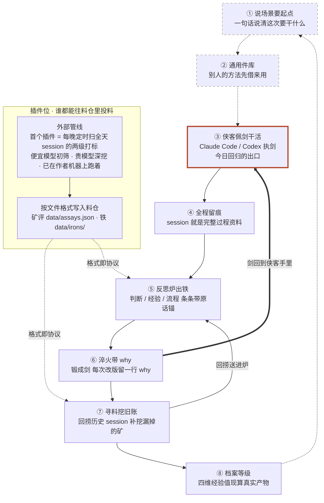

# 反思锻造台 · Reflect Forge

> **没有一份活该白干。**
>
> AI 陪你干活留下的完整记录，替你挖出原石，锻成趁手的兵器——
> 打工人的经验不随下班蒸发，而是长成自己带得走的资产。

把日常工作交给 AI 干，会话记录就是完整的过程资料。反思锻造台是一座武侠风的锻造铺：
把 session 里的精华（**铁**）用 AI 反思提炼出来，锻成可复用的 skill（**剑**）。
你是**锻造师**，Claude Code / Codex 这些 agent 是执剑的**侠客**——你不挥剑，你锻剑。

别人的方法、现成的参考，都是通用件——锻造出来的，才是你的。

⚔️ 作品已锻成——VibeHacks #05（2026-08-29）参赛作品，今晚路演。

⚒️ v2 重锻炉已开——外来秘籍 + 你的铁 = 你的版本。

**来源声明**：本仓前身是同作者赛前一日的探索原型 component-forge（2026-08-28，选件 / 草稿转正 / 带 why 改版机制）。
本仓在其机制上重组，新增反思炉内核与武侠世界观，全程 Vibe Coding 完成——commit 历史即完整过程记录，不 squash 不改写。

---

## 5 分钟跑起来

**前置只有一样**：本机装了 `claude` CLI 并且已登录。炉子调 AI 只走 `claude -p` 子进程，用 CLI 自己的订阅登录态——**不需要任何 API key**，代码里还会主动把 `ANTHROPIC_API_KEY` / `OPENAI_API_KEY` 从子进程环境里摘掉。

```bash
git clone <this-repo> reflect-forge
cd reflect-forge
python main.py
```

零依赖，纯 Python 标准库，没有 `pip install`、没有构建链。启动后终端会打出你的档案与炉址：

```
[2026-08-29 14:30] 反思锻造台开炉 · 锻造师「Tim」· 中级锻造师（…）· 铁 N 场 / 剑 M 把
[2026-08-29 14:30] → http://localhost:7712
```

浏览器打开 **http://localhost:7712**，点「开炉」进锻造台。（7711 留给前身 component-forge，两台炉子可以同时开。）

**认自己的门**（可选）：根目录 `config.json` 四个字段——`forge_master` 锻造师名号、`works_slain_base` 斩活底账、`session_dir` 寻料时翻哪个卷宗目录（默认 `~/.claude/projects/`）、`featured_scroll` 秘籍阁那卷实藏。改完重启即生效。

**产物落在哪**：`data/irons/` 是出的铁，`data/swords/` 是锻成的剑（真身文件 + 版本 / why 链 / 状态），`data/profile.json` 只存算不出来的那点东西——四维经验值一律现数真实产物，不落盘，因为这产品的整个立论就是「经验值来自真实锻造记录」。炉火留痕在 `forge.log`。

**第一炉怎么跑**：反思炉 →「粘贴」页把今天一段和侠客协作的完整会话贴进去 →「入炉」（真炉约候半炷香，30–120 秒）→ 出铁后勾几块 →「锻剑」→ 去兵器架看它，试过手再转正 / 淬火。

---

## 这条回路

整个产品只有一条回路，五间铺子都是它的切面：

```
历史 session（原石）
      ↓  入反思炉 · 烧一簇火
铁 —— 判断 / 经验 / 流程，条条带原话锚
      ↓  择其精者
  ├─ 流程性、高频的 → 锻成剑：下件活直接拿去用，改版必带一行 why（淬火）
  └─ 判断性的     → 沉成心法：不成器，但从此进你的判断链
      ↓
日报 / 周报 / 述职 —— 是这条回路的副产品，不是目的地
```

完整回路八步（虚线 = v2 尚未开锋的两步）：



四句话把它讲透：

1. **原石在 session 里**。前提是活让 AI 干、下指令带 why——过程资料才完整无失真。
2. **人自己捞不出来**：记不全，还困在自己的信息茧房。所以让 AI 对着**完整记录**反思，不对着记忆反思。
3. **铁要带原话锚**。每块铁都指回当时那句话，你才验得动它是真判断还是漂亮话。
4. **剑的真身是一份 SKILL.md**——行业标准形态，能带走、能给别人、能被任何 agent 直接执行。剑不在多，贵在真斩过活。

述职这件事，是这条回路顺手掉出来的东西：铁都在册、剑都有 why 链，日报周报不过是把账念一遍。

---

## 锻造铺五间

| | 铺面 | 一句话 |
|:--|:--|:--|
| 壹 | **反思炉** | 完整记录是矿脉，反思炉不靠记忆猜——入炉捞出你当时的判断、踩过的坑、改过的流程。 |
| 贰 | **兵器架** | 草稿先试锋，斩活后转正；每次淬火都留一行 why，剑的来路与长法因此可追。 |
| 叁 | **寻料** | 侠客做过的每场活都留下过程卷宗，先看矿脉，再把值得回捞的旧 session 送进炉。 |
| 肆 | **兵器谱** | 十八般兵器一谱铺开，今日只亮一格「一套述职剑法」，其余不是删掉，只是尚待开炉。 |
| 伍 | **秘籍阁** | 反思不只回看自己，也要让前辈经验进入判断链——被引用的秘籍会在铁上留下朱砂小印。 |

---

## 后续江湖

已经在图上、今日未开锋的几处（灰着的格子不是缺功能，是把「还能长成什么样」摆在明面上）：

- **插件位已就位**——`data/assays.json`（矿评）与 `data/irons/`（铁）的文件格式**即接入协议**，任何外部工具按格式写入，就被锻造台呈现，不必改一行炉子的代码。首个插件是作者机器上每晚定时扫全天 session 的两级打标管线（便宜模型初筛、贵模型深挖），赛后完成格式适配即接入。
- **炉子即仪表盘**——点炉火看今日烧了多少 token，点铁砧看今日锻了几把。
- **心法通道**——判断类的沉淀有自己的专属去处，不再被硬塞成剑。
- **我的件成为团队的通用底座**——一个人锻出来的剑，长成一队人共用的地基。
- **锻造师社交**——换秘籍、交友、赠剑（赠出去的剑需重铸，才认新主人的手）。
- **余下十七般兵器**——刀枪棍棒各有其形，各配一类活。
- **秘籍阁扩容**——把前辈经验做成可随时请教的导师，而不是一卷躺着的死书。

---

- 总设计稿：[docs/DESIGN.md](docs/DESIGN.md)
- 视觉线任务书（Codex）：[prompts/codex-visual.md](prompts/codex-visual.md)
- 逻辑线任务书（Claude Code）：[prompts/claude-backend.md](prompts/claude-backend.md)
